Cela fait déja un bout de temps que j'ai cette camera Sonoff qui est un matériel grand publique , peu cher (environ 30 euros) et de bonne qualité.

Mais ce aui est surtout intéressant, c'est la possibilité de l'utiliser sans le cloud et d'y ajouter le protocole ONVIF non présent d'origine.

Bien sur pour cela il faut un hack, mais ne partez pas, c'est un simple transfert sur carte SD.

Voici la procédure.

## Connexion au réseau local.
Pour cela pas de mystère, vous êtes obligé de télécharger l'application [eWeLink - Smart Home sur le Play Store](https://play.google.com/store/apps/details?id=com.coolkit), 

>Comme l'application Tuya, vous n'êtes pas obligé de vous créer un compte, il y a une version test qui suffit a l'ajout de votre caméra sur le réseau.

>La camera ne peut s'associer que via le son, toutes les autres méthodes n'ont pas marchés pour moi.

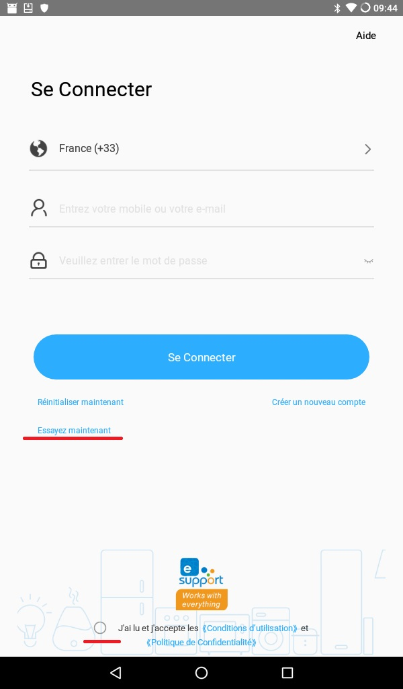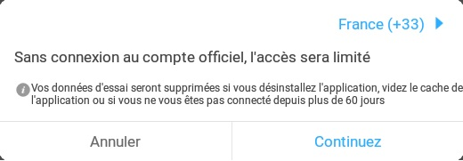
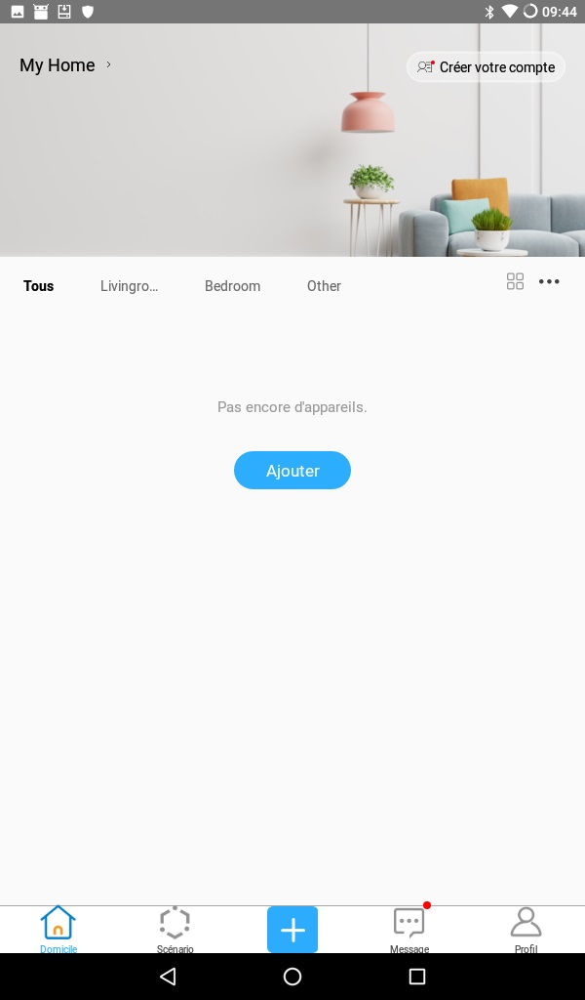
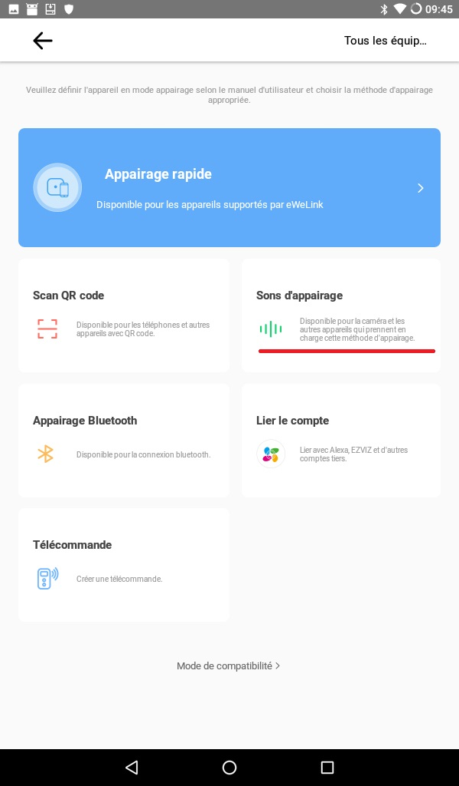
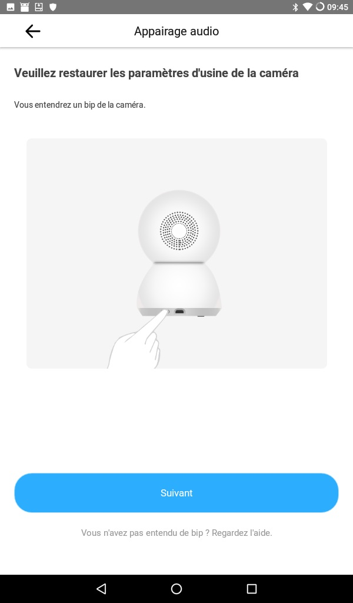
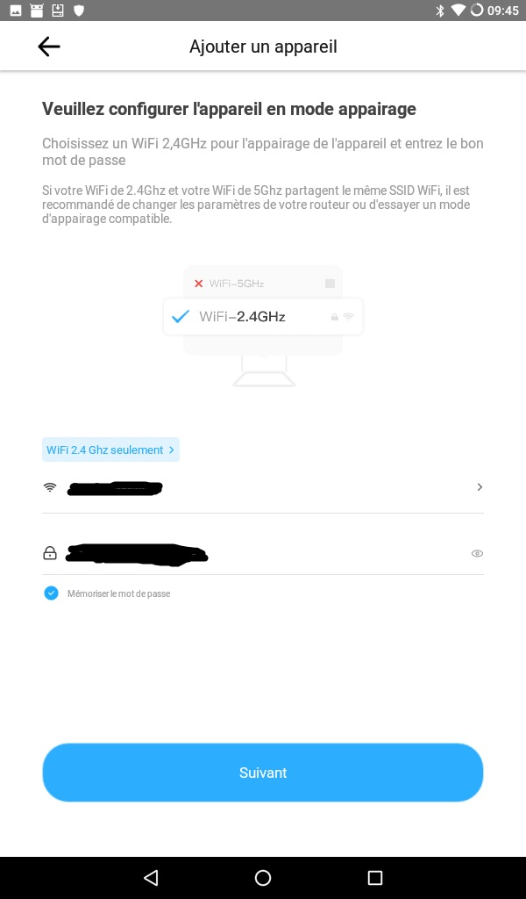
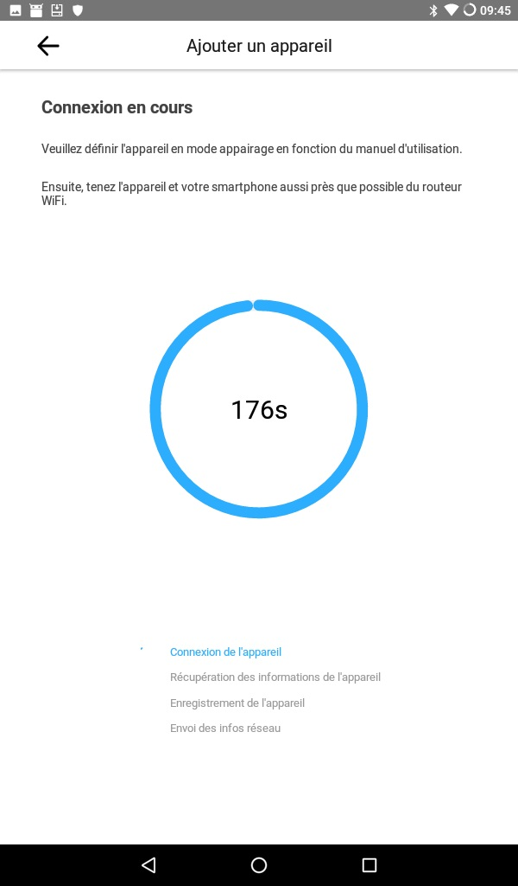
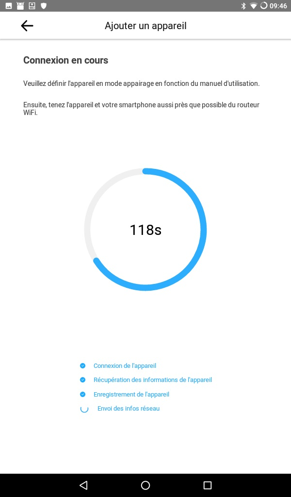
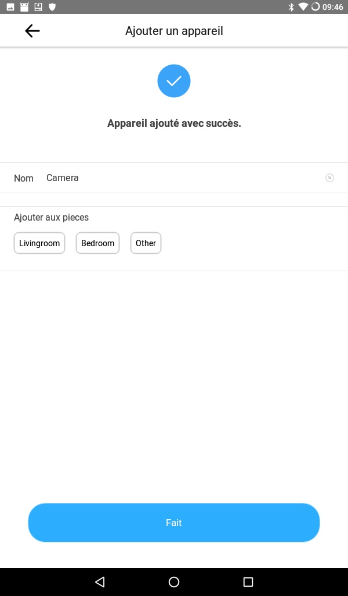
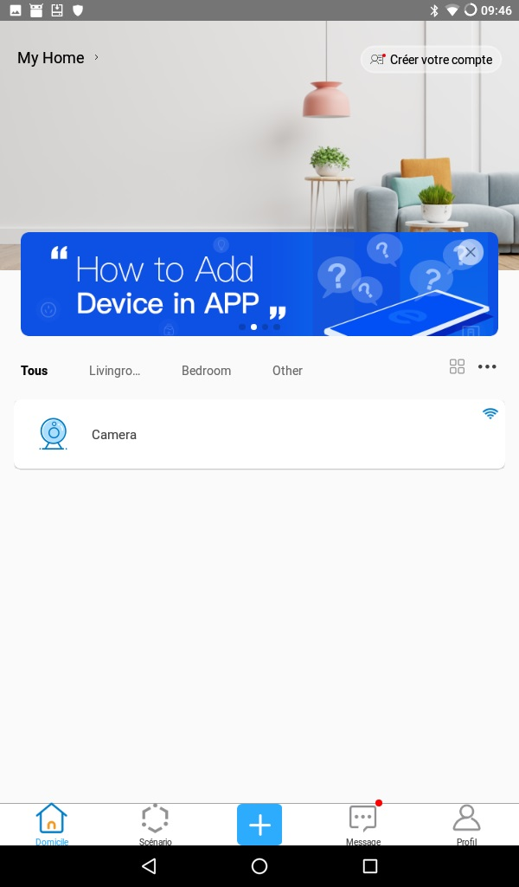
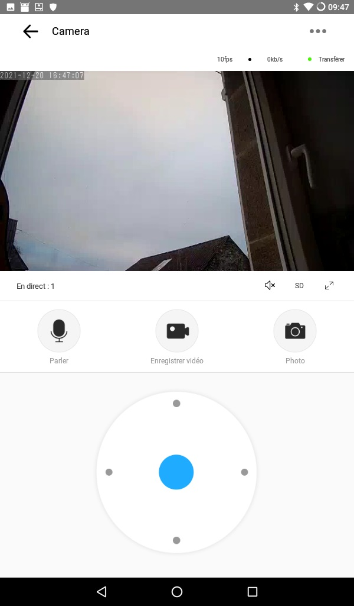

Une fois que votre caméra est connectée, il vous faut récupérer l'adresse IP.
Pour cela, deux méthodes :
* Via l'interface de votre routeur,
* Via l'application eWelink (Cliquer sur votre caméra->...(en haut a gauche)->Plus de paramètres->RTSP)

## Ajout du hack
La sopurce du hack se trouve [ici](https://github.com/roleoroleo/sonoff-hack)

