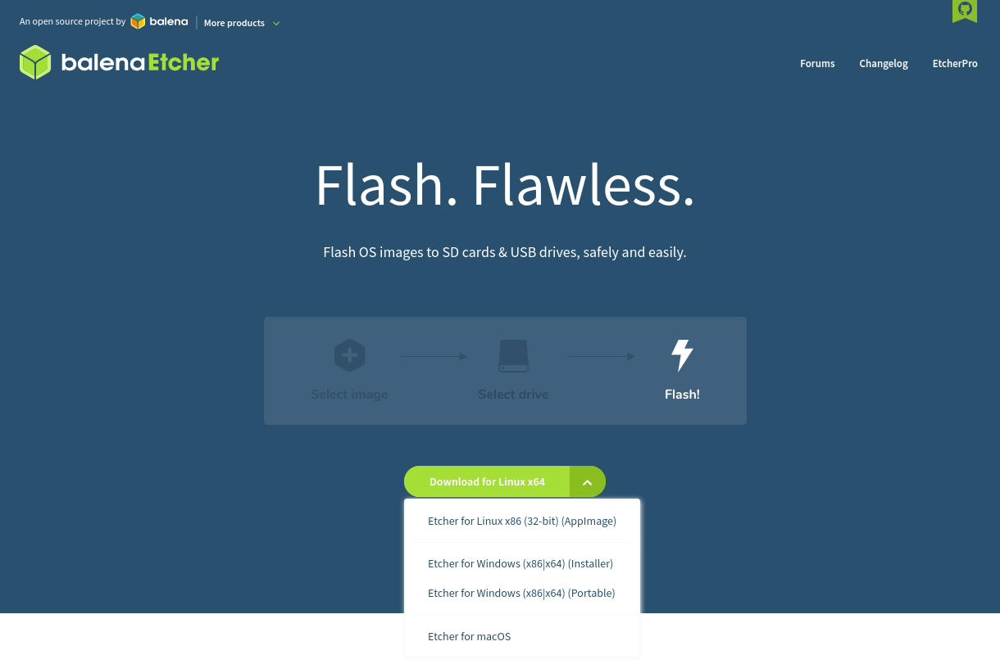

Nous allons voir rapidement comment utiliser Balena Etcher pour copier vos systèmes d'exploitation (OS) sur un support amovible en vue de les installer sur une machine ou tout simplement de démarrer dessus.

C'est un logiciel très simple d'utilisation avec deux possibilités :
* À partir d'un OS téléchargé,
* À partir d'une URL.

## Utilisation

Il vous suffit de récupérer la version correspondante à votre OS sur le [site de Balena Etcher](https://www.balena.io/etcher/)

Une fois récupéré et installé, il ne vous reste plus que trois étapes :
* Sélectionner l'image (OS) téléchargé OU via une URL,
* Sélectionner le support,
* Cliquer sur FLASH.



Voici une série d'images.



Vous avez vu, c'était rapide ;)
