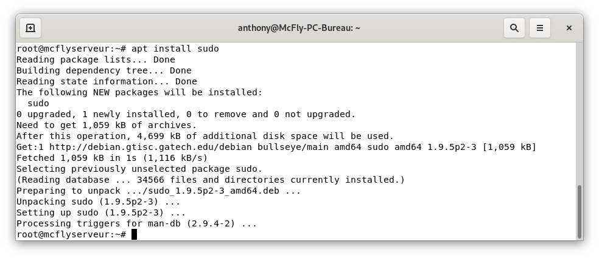
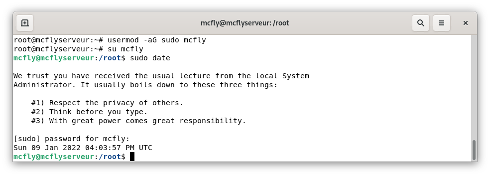

Comme vous avez dû le remarquer depuis la version 10 de Debian nommée Buster, une commande avec `sudo` renvoie que `sudo` est introuvable. Et oui depuis cette version, Debian n'installe plus `sudo` par défaut. 

Voici la méthode pour retrouver cette commande.

## Installation.
Dans un terminal, [connectez-vous en SSH](./../connexion_ssh/)

Passer en `root` (si vous êtes connecté via un utilisateur) puis procéder à l'installation avec les commandes suivantes :

```bash
su root
apt install sudo -y
```


## Ajout d'un utilisateur au groupe `sudo`.
```bash
usermod -aG sudo votre_user
```

### Tester
Reconnecter vous avec votre utilisateur puis afficher la date.
```bash
su votre_user
sudo date
```



## Conclusion

Vous voilà avec la possibilité de lancer des commandes en administrateur sans pour cela changer d'user en permanence.

Cet article est plus un mémo qui me permet de ne pas devoir rechercher en cas de doute.

## Sources
* [HowToWared](https://howto.wared.fr/debian-sudo/)
* [Debian.org](https://wiki.debian.org/fr/sudo)