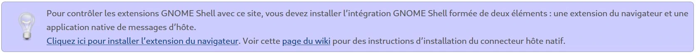

## Installer une extension Gnome.
>Pour ma part je suis sous Gnome 3.38 (par défaut dans Debian 11) et je passe par l'[extension Firefox Gnome Shell Intégration](https://addons.mozilla.org/fr/firefox/addon/gnome-shell-integration/ "Site Officiel de l'extension") que je désinstalle une fois l'extension est installée.

Rendez-vous sur le [site des extensions Gnome](https://extensions.gnome.org/) et plus précisément sur l'extension [dash to dock](https://extensions.gnome.org/extension/307/dash-to-dock/).

Si vous n'avez pas encore installé l'[extension Firefox](https://addons.mozilla.org/fr/firefox/addon/gnome-shell-integration/), cliquer sur le bandeau pour le faire puis autoriser et ajouter (pas besoin de l'autoriser en navigation privée).

#### Sources
* [Site des extensions Gnome](https://extensions.gnome.org/)
* [Extension Gnome pour Firefox](https://addons.mozilla.org/fr/firefox/addon/gnome-shell-integration/)

