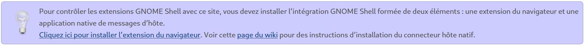
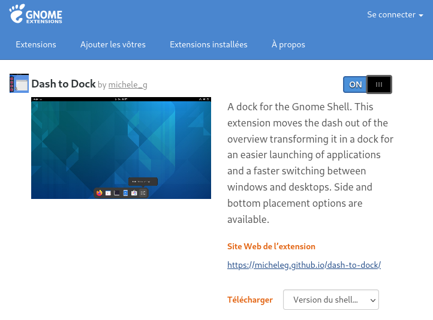
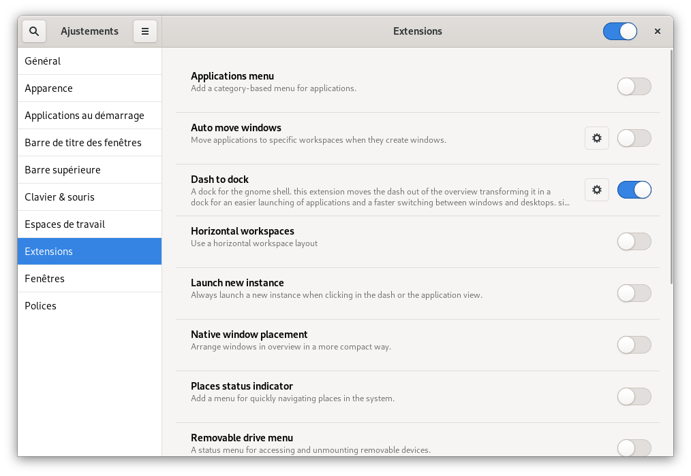
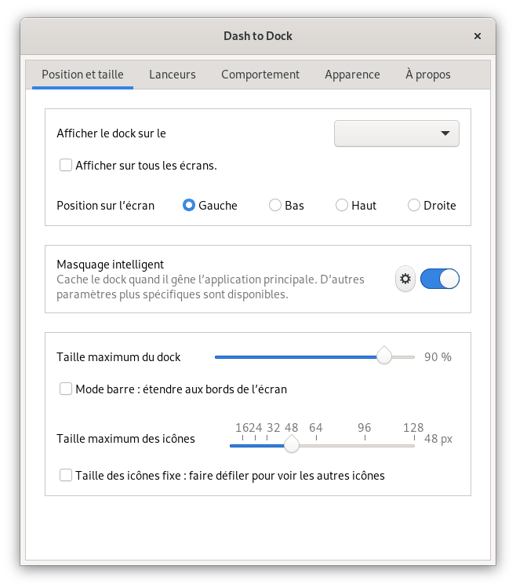

Que l'on aime ou pas, l'interface Gnome est sûrement la plus présente dans les distributions Linux. 
Debian 11 n'y échappe pas et propose par défaut Gnome en version 3.38. 
Personnellement, je n'apprécie pas le dock sur le côté gauche en plus d'un clique de souris. Alors grâce à la multitude d'[extensions disponibles avec Gnome](https://extensions.gnome.org/), voilà comment ajouter le dock en bas et accessible par simple survole de souris.

## Installer une extension Gnome.
>Pour ma part je suis sous Gnome 3.38 (par défaut dans Debian 11) et je passe par l'[extension Firefox Gnome Shell Intégration](https://addons.mozilla.org/fr/firefox/addon/gnome-shell-integration/ "Site Officiel de l'extension") que je désinstalle une fois l'extension est installée.

Rendez-vous sur le [site des extensions Gnome](https://extensions.gnome.org/) et plus précisément sur l'extension [dash to dock](https://extensions.gnome.org/extension/307/dash-to-dock/).

Si vous n'avez pas encore installé l'[extension Firefox](https://addons.mozilla.org/fr/firefox/addon/gnome-shell-integration/), cliquer sur le bandeau pour le faire puis autoriser et ajouter (pas besoin de l'autoriser en navigation privée).

Une fois l'extension installée, cliquer sur la bascule en haut de la page.

Un popup vous invitant à télécharger et installer l'extension va s'ouvrir, il vous suffit d'accepter.

## Configuration
Rendez-vous maintenant dans `activité` puis rechercher `Ajustements`. 
Dans `extensions`, allez dans les réglages de Dash To Dock.

Sélectionner la position de votre dock en bas (ou autre).

## Conclusion
Vous voilà avec un dock que je considère plus pratique, vous pouvez désactiver/désinstaller l'extension gnome shell intégration si vous n'avez plus d'extension à ajouter.

#### Sources
* [Site des extensions Gnome](https://extensions.gnome.org/)
* [Extension Gnome pour Firefox](https://addons.mozilla.org/fr/firefox/addon/gnome-shell-integration/)
