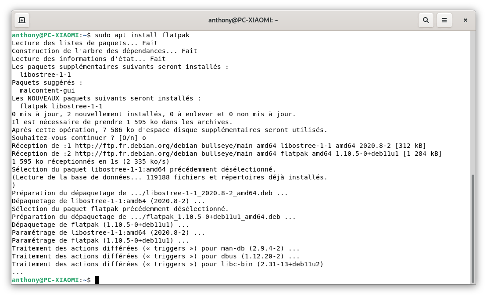
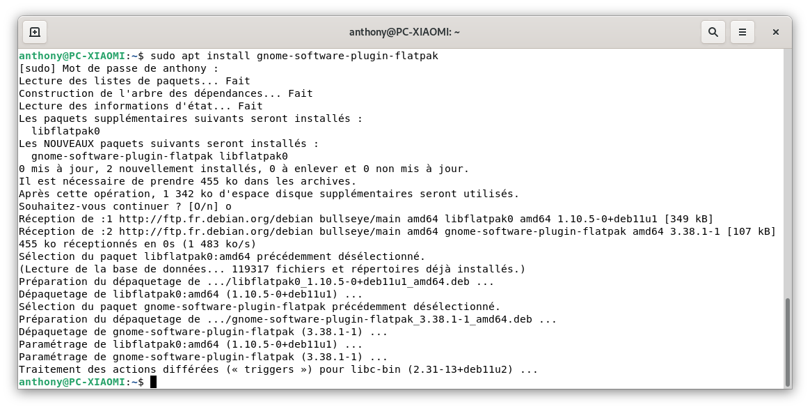
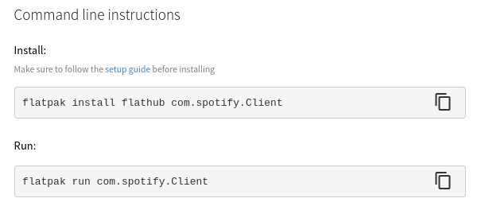

**Flatpak qu'est-ce que c'est ?**

Je ne vais pas réinventer la roue, voici la première ligne de la page Wikipédia.




Pour imager et si vous avez lu d'autres articles de mon blog, c'est un peu comme si vous installez vos applications avec Docker.
Cela permet aussi de faciliter le travail des développeurs, car flatpak est compatible avec la quasi-totalité des distributions.

Les applications sont plus lourdes (en poids d'installation) mais cela vous permet de bénéficier des dernières versions, contrairement à celles disponible sur les logithèques des systèmes d'exploitations (surtout Debian).

Vous allez me dire, qu'**il n'est pas toujours nécessaire d'avoir la dernière version d'une application**, sauf si celle-ci est liée  a la sécurité (dans ce cas elle est, dans la plupart du temps, mise à jour sur les logithèques des OS)

**Vous avez tout à fait raison** et c'est donc à vous de voir, même si dans l'ensemble il n'y a aucun inconvénient à installer la version à jour, que ce soit via Flatpak ou en CLI.

## Installation de Flatpak.

Il faut avoir installé [sudo](/articles/debian_ajouter_sudo/) puis un petit `sudo apt update && sudo apt upgrade`.

Ensuite, une seule commande suffit.

```bash
sudo apt install flatpak
```

### Ajouter les paquets Flatpak.

```bash
sudo apt install gnome-software-plugin-flatpak
sudo flatpak remote-add --if-not-exists flathub https://flathub.org/repo/flathubflatpakrepo
```


## Installation d'une application.

Parfois, vous pouvez avoir accès directement aux applications Flathub depuis votre logithèque, sinon il vous suffit : 
* D'aller sur [FlatHub](https://flathub.org/home), 
* Rechercher votre logiciel,
* Cliquer sur `install`.

Si vous préférez la ligne de commande, en bas de la page de l'application recherche, il y a la commande d'installation et celle pour lancer l'application.



## Conclusion.
Il y a beaucoup d'échange sur internet à propos de l'installation d'applications via Flatpak.
Je pense, personnellement, que c'est un chemin  intéressant pour une personne débutant sous Linux ou ne voulant pas taper de la ligne de commandes pour installer ou tester un logiciel.

Libre à chacun de se faire sa propre opinion.

## Sources.
* https://www.flatpak.org/
* https://www.flatpak.org/setup/Debian/
