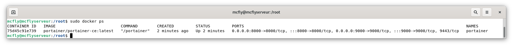
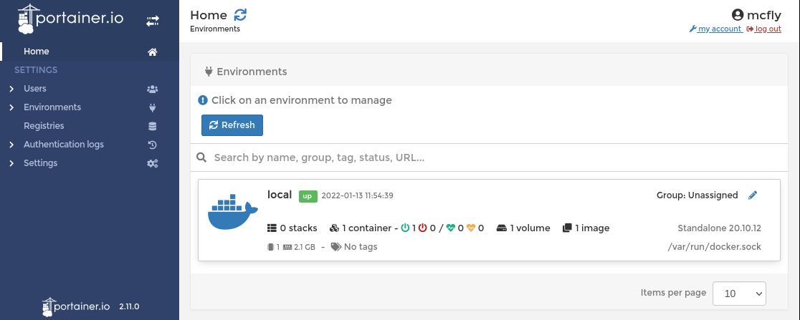

Je ne vais pas m'étendre sur le sujet, mais pour faire simple, il permet d'installer et de tester des applications sans devoir chambouler ou jouer sur la configuration brute du système.

Voici deux citations de Wikipédia.





Il existe deux versions de Docker :
* Docker CE pour Community Edition (celle qui nous intéresse),
* Docker EE pour Entreprise Edition.

Fin du blabla

## Installation de Docker.
Je pars du principe que vous avez déjà Debian 11 d'installé sur votre machine et que vous savez vous [connectez en SSH](../ssh_connexion/) à serveur.



On commence par mettre à jour les paquets du système et le système lui-même.
```bash
sudo apt update && sudo apt upgrade
```

On installe les dépendances.
```bash
sudo apt install \
    ca-certificates \
    curl \
    gnupg \
    lsb-release
```
Ajout de la clé GPG Docker pour Debian.
```bash
curl -fsSL https://download.docker.com/linux/debian/gpg | sudo gpg --dearmor -o /usr/share/keyrings/docker-archive-keyring.gpg
```
ou Raspbian / Raspberry Pi OS.
```bash
curl -fsSL https://download.docker.com/linux/raspbian/gpg | sudo gpg --dearmor -o /usr/share/keyrings/docker-archive-keyring.gpg
```
Cette ligne suivante permet de choisir la version que l'on souhaite installer, nous prenons la `stable` par défaut.
```bash
echo \
 "deb [arch=amd64 signed-by=/usr/share/keyrings/docker-archive-keyring.gpg] https://download.docker.com/linux/debian \
 $(lsb_release -cs) stable" | sudo tee /etc/apt/sources.list.d/docker.list > /dev/null
```
Une dernière mise à jour puis l'installation de Docker.
```bash
sudo apt update
sudo apt install docker-ce docker-ce-cli containerd.io
```
### Ajout d'un utilisateur.
Ajouter son utilisateur (ou un créé spécialement) au groupe `docker` puis tester votre version de Docker.
Cela permet d'éviter l'utilisation de l'user `root`, donc de sécuriser les différentes manipulations.

```bash
sudo usermod -aG docker votre_user
docker -v
```


Docker est maintenant installé et fonctionnel.


## Installation de Portainer.
Portainer est une sorte d'interface graphique pour gérer les conteneurs Docker.
Il permet de créer des containers, et d'utiliser des fichiers Docker-compose ou Kubernetes pour créer des stacks (ensemble de conteneurs). Nous verrons cela dans d'autres articles.

Création d'un volume Docker.
```bash
sudo docker volume create portainer_data
```
Téléchargement et installation de l'image (container) Portainer
```bash
sudo docker run -d -p 8000:8000 -p 9000:9000 --name=portainer --restart=always -v /var/run/docker.sock:/var/run/docker.sock -v portainer_data:/data portainer/portainer-ce:latest
```

Vérifier la version et la présence de ce dernier avec la commande `docker ps`.


### Première connexion.
Ouvrez votre navigateur et connectez-vous à l'interface avec `ip_de_votre_serveur:9000`
* Renseigner un  nom d'utilisateur et un mot de passe solide.
* Sélectionner `Get Started` pour se connecter à l'environnement local.





## Désinstaller Docker.
Si vous souhaitez supprimer Docker (cela supprimera tous les containers installés)
```bash
sudo apt remove docker docker-engine docker.io containerd runc
```

## Conclusion.

Vous avez à présent la possibilité de tester n'importe quelle application sans devoir toucher un seul fichier de votre système.


## Sources.
* https://docs.docker.com/engine/install/debian/
* https://docs.portainer.io/v/ce-2.6/start/install/server/docker/linux