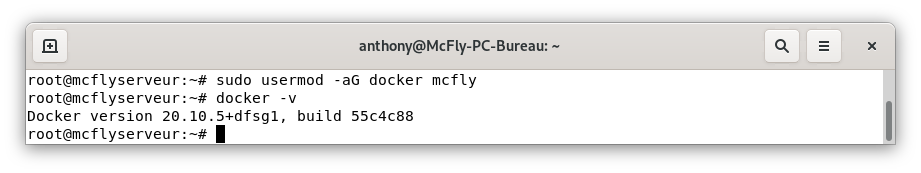
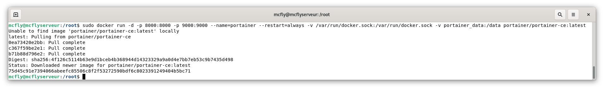

Je pars du principe que vous avez déja installé Raspberry Pi OS sur votre Raspberry est changé votre mot de passe.

Connectez vous en SSH a votre Raspberry via la commande suivante puis saisissez votre mot de passe.


```
ssh pi@ip_de_votre_raspberry

```

## Installation de Docker
puis une petite mise à jour
```
sudo apt update && sudo apt upgrade
```
```
sudo apt install \
    ca-certificates \
    curl \
    gnupg \
    lsb-release
```

```
curl -fsSL https://download.docker.com/linux/debian/gpg | sudo gpg --dearmor -o /usr/share/keyrings/docker-archive-keyring.gpg
```

```
echo \
 "deb [arch=amd64 signed-by=/usr/share/keyrings/docker-archive-keyring.gpg] https://download.docker.com/linux/debian \
 $(lsb_release -cs) stable" | sudo tee /etc/apt/sources.list.d/docker.list > /dev/null
```

```
sudo apt update
sudo apt install docker-ce docker-ce-cli containerd.io
```

Ajouter son utilisateur au groupe `docker` puis tester votre version de Docker.

```
sudo usermod -aG docker mcfly
docker -v
```



# Installation de Portainer


```
docker volume create portainer_data
docker run -d -p 8000:8000 -p 9443:9443 --name portainer \
    --restart=always \
    -v /var/run/docker.sock:/var/run/docker.sock \
    -v portainer_data:/data \
    cr.portainer.io/portainer/portainer-ce
```

connectez vous sur `ip_de_votre_serveur:9001`




# Désinstaller Docker

```
sudo apt remove docker docker-engine docker.io containerd runc
```
## Sources
* https://docs.docker.com/engine/install/debian/
* https://docs.portainer.io/v/ce-2.6/start/install/server/docker/linux
