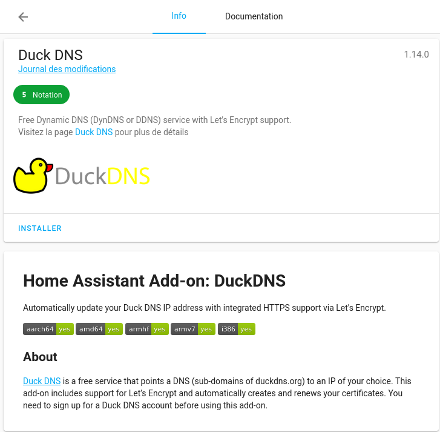

Les add-ons permettent d’ajouter des fonctions, services ou autres à votre Home Assistant. Des services très connus et reconnus (comme Node-Red, Grafana, InfluxDB, DuckDNS, etc.) sont déjà presque configuré pour communiquer simplement avec votre système domotique.

Il existe deux types d’extensions :
* Les officielles : reconnues officiellement par Home Assistant,
* Les non-officielles : nécessitant l'ajout du dépôt GitHub en manuel.

L'installation des extensions étant toujours la même, voici les différentes méthodes.



## Extension Officielle.
Pour les extensions officielles, il n'y a rien de compliqué.



Dans Home Assistant, cliquer sur `Configuration`-> `Modules complémentaires, Sauvegardes et Superviseur` -> `Boutique des modules complémentaires`.
* Rechercher l'add-on,
* Cliquer dessus,
* Puis `INSTALLER`

Les add-ons sont quasiment tous fait pareil.
Une fois installé vous avez quatre onglets en haut.
* **Info** : Permet de contrôler l'add-on et donne une description.
* **Documentation** : Explique son fonctionnement et ses réglages possibles.
* **Configuration** : Permet de configurer l'add-on,
* **Journal** : Vous donne les logs sur le fonctionnement de l'add-on.

Un exemple en image avec l'add-on DuckDNS.


## Extension non officielle.

Les extensions non officielles permettent aux développeurs de mettre à disposition leur travail sans forcément attendre une validation officielle.
Cela permet de rendre Home Assistant encore plus extensible.

Pour ajouter un add-on non officiel il va falloir ajouter un nouveau dépôt dans la boutique des modules complémentaires.

Dans Home Assistant, cliquer sur `Configuration`-> `Modules complémentaires, Sauvegardes et Superviseur` -> `Boutique des modules complémentaires` ->`...` en haut à droite-> `Dépôts`. 

* Ajouter le lien du dépôt,
* Rafraichir la page via `F5` ou via `Rechercher des mises a jour` dans les `...` en haut à droite.
* Chercher maintenant l'add-on voulu et `INSTALLER`.





## Conclusion
Nous venons de mettre à disposition de notre instance une multitude de possibilités.

Nous verrons par la suite quelques add-ons indispensables.

 