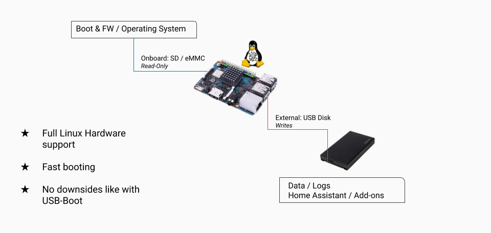
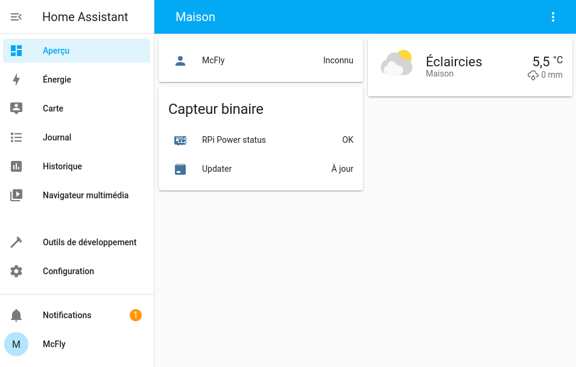

Pour cela il y a plusieurs solutions, l’installation sur :

    un nano ordinateur (Raspberry Pi, Orange Pi, etc etc),
    un NAS que vous détenez déjà,
    une VM (Machine Virtuel),
    et encore plein d’autres types d’installation.

Si vous êtes débutant dans la domotique ou linux, je vous conseille de commencer par l’installation sur un Raspberry.

Les avantages d’un RPi :

    consomme peu d’énergie (inférieure à 20 euros par an pour une utilisation 24/24H et 7/7J),
    bénéficie de multiples connexions (Ethernet, Wifi, Bluetooth),
    une image d’installation dédiée existe déjà (l’utilisation d’un RPi est recommandé par Home Assistant ),
    contient tout le nécessaire (en termes de Superviseur),
    simple d’utilisation.

Les inconvénients :

    Installation sur carte micro SD qui peut provoquer des erreurs d’écritures avec le temps (remplacer la Micro SD par un Disque SSD).
    Le choix d’installation suivant condamne votre Raspberry à une seule utilité.

Le choix du Raspberry est important, car Home Assistant permet tellement de choses que vous allez vous retrouver avec une installation utilisant beaucoup de mémoires.
Je vous conseille un Raspberry Pi 3B+ au minimum, mais le mieux reste un Raspberry Pi 4 avec minimum 2Go de RAM.
Assez bavardé.

Home Assistant est à l'heure actuel, le meilleur système domotique sur le marché (ok, c'est mon avis, mais peu de personne ayant quitté leur ancien système domotique pour Home Assistant y sont revenus).

Il est open-source, international, responsive (s'adapte à tous les écrans), élégant et complétement gratuit (application mobile aussi). Il bénéficie aussi d'une grande communauté qui le fait évoluer à la vitesse lumière et lui permet d'être présent sur tous les fronts (Wear OS, extension Chrome et Firefox). Home Assistant est écrit en python (un langage "simple" à apprendre) et construit sur une base "docker" ce qui permet de lui ajouter des services à l'infini.

**"Comment il vend le produit !"** Oui je l'avoue, mais ayant testé Jeedom puis Domoticz, je parle en connaissance de cause.

Il y a plusieurs moyens d'installer Home Assistant et nous allons en voir deux sur mon blog :
* Sur un Raspberry en version OS supervised avec carte SD et optionnellement un disque dur. (Méthode préconisée par Home Assistant),
* Sur Raspberry ou autre SBC (Single Board Computer), mais cette fois via Docker et Portainer. (À éviter si vous débuter).



**Prérequis :**
* Raspberry Pi est son alimentation
* Carte Micro SD (classe 2 recommandée)
* Disque dur SSD (Avec boitier si besoin)*
* Un boitier pour protéger votre installation*
* [Balena Etcher](https://www.balena.io/etcher/) (Linux, Windows, Mac)
* [L'image pour votre système](https://github.com/home-assistant/operating-system/releases)*

*optionnel pour une installation de test, mais pas pour une installation de production.



**Pourquoi il utilise une carte Micro SD alors que, sur le net, tout le monde parle de problèmes avec les cartes SD ?**

Parce que [Home Assistant le recommande](https://www.home-assistant.io/common-tasks/os/#using-external-data-disk).

__*Explication :*__ Dans ce type d'installation, toutes les actions provoquant des écritures à répétitions sur le support SD sont déplacées vers le disque dur. Fin de la carte SD corrompues.

J'ai tourné quelque temps avec cette solution et je n'ai jamais rencontré de soucis, maintenant à vous de voir.

## Installation.
Lancer Balena Etcher
* Sélectionner votre [image](https://github.com/home-assistant/operating-system/releases) (téléchargé) ou [le lien](https://www.home-assistant.io/installation/raspberrypi#install-home-assistant-operating-system)
* Sélectionner votre Micro SD,
  


* Cliquez sur `Flash`.



Une fois la copie terminée, mettre la carte micro SD dans votre Raspberry puis démarrer votre système.

## Première configuration.



Essayer de vous connecter via l'adresse suivante http://homeassistant:8123 ou http://homeassistant.local:8123. Si rien ne s'affiche récupérer l'adresse IP de votre Raspberry via l'interface de votre routeur et connectez-vous via http://votre_ip:8123

Vous arrivez sur une page vous disant d'attendre. Cela peut prendre jusqu'à 20 minutes selon votre connexion internet.



Une fois sa préparation terminée, il va vous demander quelques paramétrages :
Sur la première page.
* Un nom pour votre utilisateur,
* Un nom d'utilisateur,
* Un mot de passe et sa confirmation
  


La seconde page concerne l'habitation.
* Donner un nom votre installation,
* Définir la localisation de votre domicile,
* Choisir le fuseau horaire,
* Rentrer l'[altitude de son domicile](https://www.calcmaps.com/fr/map-elevation/)
* Choisir le système métrique.

La troisième vous permet de partager anonymement certaines données, pour aider Home Assistant à améliorer le système.

La quatrième concerne les matériels détectés automatiquement par Home Assistant chez vous.
Vous pouvez passer cette étape, on y reviendra plus tard. Ils peuvent être retrouvés dans `Configuration -> Appareils et Services`

Vous voilà enfin sur l'interface de Home Assistant.

Vous voilà enfin sur l'interface de Home Assistant.

## Déplacer ses données vers un support externe.
Pour préserver la carte Micro SD tout en gardant un système rapide, Home Assistant préconise de déplacer les données utilisateur sur un support externe (il peut être interne avec un boitier adapté).

Pour cela rien de plus simple :
* Dans `Configuration`, `Paramètres`, onglet `Infos`.
* Descendez jusqu'à `Home Assistant Supervisor` puis appuyer sur `GERER`.
* Dans l'onglet ` système`, dans le cadran `Host`, appuyer sur les trois petits point puis sélectionner `Déplacer le disque de données`.

Puis sélectionner le disque.
Home Assistant redémarre.



Vos données seront maintenant sur le disque dur et les écritures ne viendront plus abimer votre carte Micro SD.

## Activer les paramètres avancés.
Le mode avancé vous permet d'avoir plus de contrôle sur votre serveur.
Cliquer sur votre utilisateur (dans le menu) puis activer `Mode avancé`



## Conclusion.
Vous venez d'installer Home Assistant de la plus simple manière qu'il soit, la plus optimisée et surtout de manière pérenne.

Cette méthode permet d'éviter les problèmes de détection du disque dur lié a USB3 et permet aussi au système de profiter d'un démarrage rapide.

Le système Home Assistant est optimisé pour cela et non pour tourner sur un disque dur externe au système.



https://forum.hacf.fr/t/installer-home-assistant-sur-raspberry-pi-ou-autre-sbc-via-hassos/201
https://forum.hacf.fr/t/home-assistant-premiere-configuration/679

https://forum.hacf.fr/new-topic?title=Titre+de+votre+probl%C3%A8me&body=%23%23+Mon+probl%C3%A8me%0D%0A%0D%0A%2ARenseigner+votre+probl%C3%A8me%2A%0D%0A%0D%0A%23%23+Le+tutoriel+d%27origine%0D%0A%0D%0Ahttps%3A%2F%2Fforum.hacf.fr%2Ft%2Finstaller-home-assistant-sur-raspberry-pi-ou-autres-sbc-debian-methode-docker-avec-supervisor%2F676%2F%0D%0A%0D%0A%23%23+Ma+configuration%0D%0A___%0D%0A%5Bcenter%5DTexte+%C3%A0+remplacer+par+votre+configuration%5B%2Fcenter%5D%0D%0AComment+r%C3%A9cup%C3%A9rer+ma+configuration+%3A%0D%0ADans+votre+HA%2C+Menu+lat%C3%A9ral+%60Configuration%60+%3E+%60Info%60+%3E+bouton+copier+%3E+%60Pour+Github%60%0D%0A+++%21%5Bimage%7C648x167%2C+75%25%5D%28upload%3A%2F%2F1ietIxFU6nXP1GFrJTzwc2mh0j2.png%29%0D%0A___&category=entraide-home-assistant&tags=aide

## Sources.
* https://www.home-assistant.io/common-tasks/os/#using-external-data-disk
* https://www.home-assistant.io/installation/
* https://www.home-assistant.io/installation/raspberrypi#install-home-assistant-operating-system
