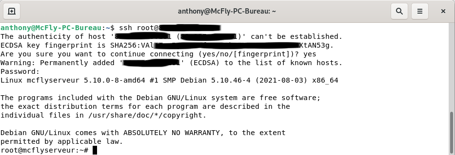
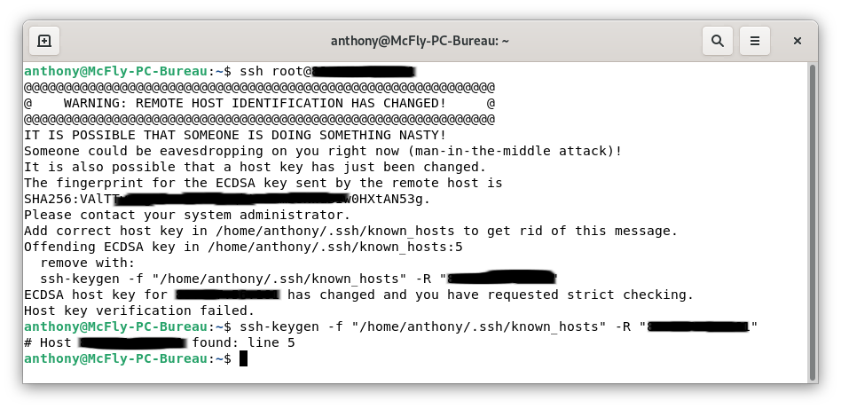

Dès que l'on commence à travailler avec un serveur ou en ligne de commande, la connexion en SSH devient obligatoire.

Voici comment se connecter simplement en SSH avec un utilisateur et un mot de passe.

Nous verrons dans un prochain article comment [augmenter la sécurité de cette connexion](../ssh_securiser_connexion/).

## Connexion SSH depuis Linux
Dans un terminal, connectez-vous en SSH via la commande `ssh root@ip-de-votre-serveur`

Si c'est la première connexion sur votre serveur il vous demandera de valider la clé ECDSA en tapant `yes`

Si vous vous êtes déjà connecté sur ce serveur avant une réinstallation, il vous demandera de supprimer l'ancienne clé via la commande suivante.
`ssh-keygen -f "/home/anthony/.ssh/known_hosts" -R "XXX.XXX.XXX.XXX"`

## Conclusion

À vous les joies de la bidouille sur serveur.