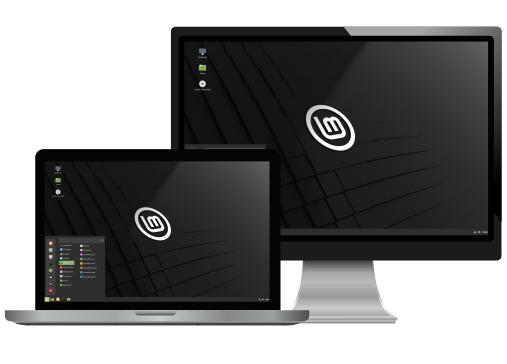

**Pourquoi parler de vie privée sur nos ordinateurs ?**
Tous simplement parce que **Windows** et **Apple** sont bourrés de **mouchards** en tous genres.

De plus, Windows est **vulnérable** à tous les virus et **machin**wares possibles (principalement, parce qu'il est aussi le plus utilisé). Cela **oblige** à installer des **antivirus** et **anti-mouchards** sujets à la surconsommation des **ressources système** sans forcément protéger l'utilisateur.
La machine Apple n'a pas tous les défauts de Windows, mais quelques un en plus d'autres.



Pour résoudre tous ces problèmes, il n'y a malheureusement pas d'autres solutions que le passage sous Linux.

J'utilise **Linux** depuis plus de trois ans et je trouve qu'il est maintenant **facile d'utilisation** et **ouvert aux débutants** grâce aux différents systèmes d'exploitations (OS) adapté aux gouts et couleurs de chacun.

Je vais vous lister quelques OS Linux adaptés aux grands débutants et vous invite à les tester dans leur version "Live" c'est-à-dire sans installation sur votre machine, pour déterminer lequel vous convient le mieux.
Commençons par celle que j'utilise dans la vie de tous les jours.

## Debian
[Debian](https://www.debian.org/index.fr.html) est, pour ma part, la solution la plus connue. Elle est **stable** et **sécurisé**.
Elle sert souvent de **base aux autres OS**, et bénéficie aussi de très 
bonnes communautés francophones [ici](https://debian-facile.org/) ou 
[ici](https://france.debian.net/).
**Disponible** en version **serveur** ou en **desktop** la possibilité 
de **choisir** son environnement de **bureau** se fait lors de 
l'installation.

Depuis Debian 11, je trouve qu'ils ont fait un réel travail sur 
l'interface, la rendant moins austère.

**Mon avis :**
C'est la solution que je recommande, car elle est stable et n'apportera pas son lot de surprise lors des mises à jour, tout en pouvant évoluer en même temps que vos connaissances.

Je tourne actuellement sur Debian que ce soit sur serveur, sur Raspberry ou sur mon PC de bureau. Cela me permet d'avoir qu'un seul système à gérer même si les commandes Linux sont fréquemment identique entre les OS.

## Ubuntu
[Ubuntu](https://ubuntu.com/) est souvent recommandé comme le système Linux pour débutants. Il est gratuit mais, **propriétaire** (Canonical). 
Il inclut des drivers propriétaires et d'autres services facilitant l'accès au grand publique.

Sachez qu'**Ubuntu** est **basé sur Debian** (je vous en parle plus loin), mais a la différence de ce dernier, elles misent plus sur le maintient à jour des services/logiciels que sur la stabilité.
Elle bénéficie de **plusieurs variantes** (Kubuntu, Lubuntu, Xubuntu, etc) adoptant des [environnements de bureau](https://doc.ubuntu-fr.org/environnements) différents et permettant une installation sur des configurations plus anciennes.

Pour finir il y a une grande [communauté Francophone](https://www.ubuntu-fr.org/). Alors c'est un très bon début (toujours mieux que Windows).

**Mon avis :** 
C'est un **bon point de départ**, mais je ne suis pas resté sur Ubuntu, car mon but est de reprendre la main sur mes données (et non de déplacer le problème dans le temps) et d'avoir un système stable et sécurisé.

## Elementary OS
[Elementary OS](https://elementary.io/) est un système **basé sur Ubuntu**, mais avec une interface qui ne décevra pas les utilisateurs de MAC.

**Pourquoi je vous parle d'Elementarys OS...** Euh parce que c'est beau !
Certes, mais aussi, car elle bénéficie d'une **interface épurée et design**, sans oublier quelques réglages permettant de limiter l'envoi de données privées. 

Elle bénéficie d'une [communauté Francophone](https://www.elementaryos-fr.org/) très active.

** Mon avis :** 
Je vous avoue que pour une **utilisation** dite "de tous les jours", elle est **simple**, avec une couche de vie privée supplémentaire et je la **recommanderais plus qu'Ubuntu**.
Maintenant, pour une utilisation plus spécifique ou poussée, cette solution n'est pas le plus adapté.

## LinuxMint
[LinuxMint](https://linuxmint.com/) est une solution **facilitant** le passage de **Windows vers Linux** grâce à son interface ressemblante. 
C'est une solution **simple et stable** est basée sur Ubuntu ou sur Debian(LMDE). C'est une **solution française** avec une vraie [communauté francophone](https://forum-francophone-linuxmint.fr/) prête à aider.

** Mon avis :** 
C'est la solution qui m'a amené dans le monde Linux et je la recommande si vous cherchez une solution simple et efficace. Je vous conseille la version Debian (LMDE) qui, je pense, deviendra la version par défaut.

## Conclusion.
Comme vous vous en doutez, mes articles seront plutôt orientés Debian ou Raspbian, mais cela n'enlève rien aux autres systèmes d'exploitation qui ont chacun leurs avantages et inconvénients, ajoutant à cela les goûts et les couleurs de chacun.
Le plus simple reste de les tester via une installation dite "Live" en téléchargeant l'image sur leurs sites officiel et l'installant via [Balena Etcher](../balena_etcher/).